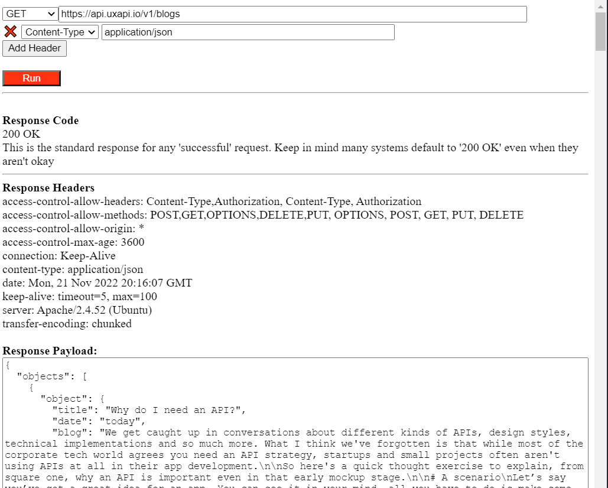
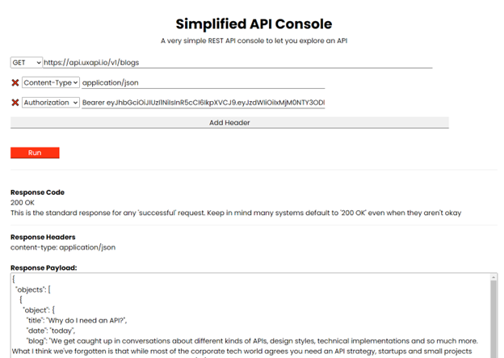

# apiconsole
A very simple AJAX console for doing GET, POST, PUT and DELETEs embedded in a web page

## Contents

* `/code/api-console.html`: A single div with HTML and JavaScript that runs simple GET/POST/PUT/DELETE RESTful API calls.

* `/code/api-console.css`: Rudimentary style on elements in the HTML to allow for customization.

## Why I wrote my own API console

There are a lot of good tools out there to run API calls from your desktop or automated from cloud services for testing and monitoring.  These tools are great for the Enterprise and they’re awesome for the savvy developer, but I just needed a very easy way for a novice to push a button and get a response, in-line with my code and helper text.

So, I just sat down one afternoon and wrote a really basic, ajax driven API console.

It ended up being 200 lines of code including the HTML and JavaScript (and of course a link to the CDN ajax library), and it's *super* basic. You can toggle methods/verbs,  enter a URL and add headers and nothing else.  It's the really basic manual kind of call that is more "functional toy" than enterprise tool.

BUT what it also lets me do is easily drop it into a static HTML page and style it.  It's all contained in a div layer and

This makes it easier to demonstrate my API in the context of a story, not just a collection of REST calls that someone fiddles with, but a live demo -- and demos always need a couple rails and controls to help the uninitiated along their journey.

It's always a tricky tightrope walk between buying and building... between the familiarity of a ubiquitous vendor that everyone knows, and delivering the message you need without having to wade through a few extra tools.

I'm not going to stop using Postman or start building my own automation instead of using things like Selenium, but it is important to step back every now and then and decide if we really need a whole platform, or just a little flexible code.

I'm sharing it here just as a way to explain my thought process (I'm really not a coder, so I know I have some odd choices in my code).  Feel free to check it out and make suggestions and changes or run with it yourself!
